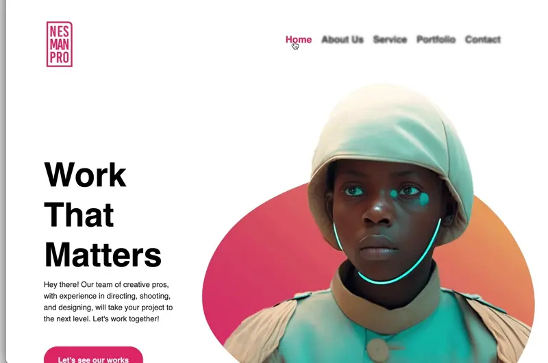

# Communication Agency Project (HTML & SASS)

This project involves the development of a website, a communication agency specializing in design, photography, web development, and branding. The main objective of the website is to promote the services offered by the agency and allow users to get in touch with the team.

## Repository Contents

The repository contains the following files:

- `contact.html`: Contact page that allows users to send inquiries and messages to the NESMANPRO team.
- `about.html`: Page that provides information about the agency, its team, and its experience in the communication industry.
- `portfolio.html`: Page that showcases featured projects completed by NESMANPRO in areas such as design, photography, web development, and branding.
- `services.html`: Page that details the services offered by the agency, including graphic design, photography, and web development, along with information about the technologies used.
- `style.scss`: Main style file, written in Sass, which compiles to CSS to style the website.

Additionally, compiled CSS files from Sass for the website styling are included.

## Technologies Used

The website has been developed using the following technologies:

- HTML5: For the structure of the website's content.
- CSS3: For the design and visual presentation of the site.
- Sass: As a CSS preprocessor to facilitate the development and maintenance of styles.
- Bootstrap 4: For creating a responsive and mobile-friendly layout.
- Hotjar: For collecting user behavior data and website analysis.

## Usage Instructions

To view the website in action, simply open the HTML files in your preferred web browser. You can navigate between the different pages using the navigation links provided at the top of each page.

To compile the Sass files into CSS, you will need a Sass compiler installed in your development environment. You can use tools like node-sass, Dart Sass, or any other tool of your choice.
